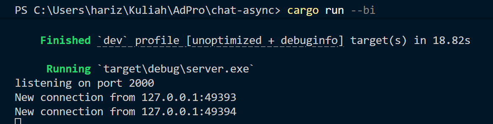
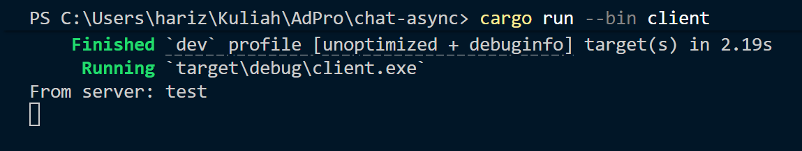
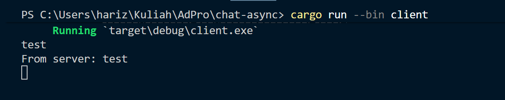
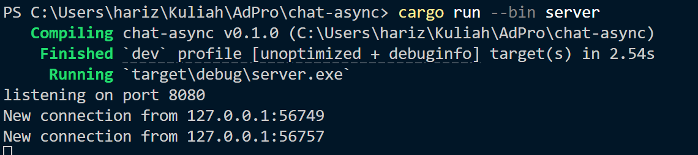
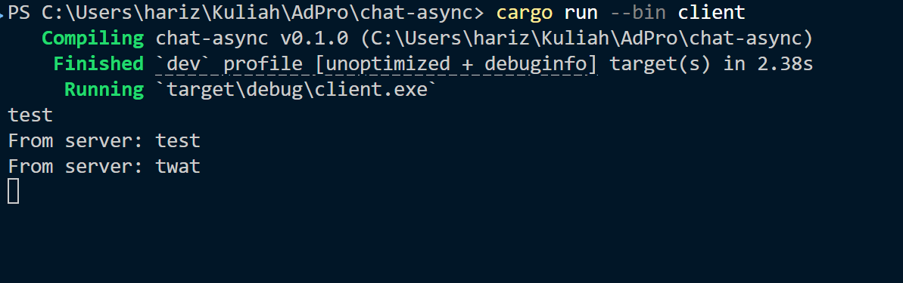
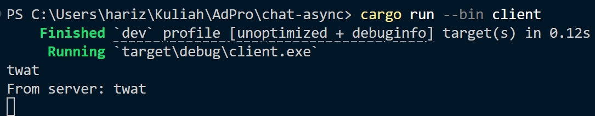

# Experiment 2.1

**Penjelasan Singkat:**
Eksperimen ini menjalankan kode dasar aplikasi *broadcast chat* berbasis *websocket* yang dibangun dengan `tokio` dan `tokio-websockets`. Proyek ini memiliki dua *binary*: 

1. **Server:** Bertugas menerima koneksi masuk, menerima pesan dari *client*, dan mengirim ulang (*broadcast*) pesan tersebut ke seluruh *client* yang terhubung menggunakan `tokio::sync::broadcast`.

2. **Client:** Bertugas membaca input dari pengguna (via `stdin`) untuk dikirim ke *server*, sekaligus membaca pesan yang datang dari *server* untuk ditampilkan ke layar.

**Cara Menjalankan:**
1. Buka satu terminal (berperan sebagai *host*) dan jalankan *server* dengan perintah:
```bash
cargo run --bin server
```

2. Buka dua atau lebih terminal baru dan jalankan client di masing-masing terminal dengan perintah:

```bash
cargo run --bin client
```

## Observasi (Apa yang Terjadi?):
Ketika saya mengetikkan pesan (misalnya "test") di salah satu terminal client lalu menekan Enter, pesan tersebut akan dikirim melalui websocket ke server.

Di dalam server, blok tokio::select! menangkap pesan tersebut dan melemparkannya ke broadcast channel. Channel ini kemudian mendistribusikan pesan ke semua subscriber (koneksi client lain). Hasilnya, pesan yang saya ketik langsung muncul seketika di semua terminal client yang sedang aktif.

Screenshot Hasil Eksekusi:


## Terminal 1
cargo run --bin server :


## Terminal 2
cargo run --bin client :


## Terminal 3
cargo run --bin client :



# Experiment 2.2: Modifying the Websocket Port

**Penjelasan Modifikasi:**
Eksperimen ini bertujuan untuk mengubah port komunikasi *websocket* dari port bawaan `2000` menjadi port `8080`. 

Karena komunikasi *websocket* merupakan koneksi dua arah (membutuhkan *handshake* antara *client* dan *server*), perubahan port wajib dilakukan di kedua sisi aplikasi agar mereka bisa saling berkomunikasi:

1. **Sisi Server (`src/bin/server.rs`):** Saya mengubah alamat *binding* pada `TcpListener` menjadi `127.0.0.1:8080`. Ini memberitahu *server* untuk membuka port 8080 dan mendengarkan koneksi masuk di sana.

2. **Sisi Client (`src/bin/client.rs`):** Saya mengubah URI target pada `ClientBuilder` menjadi `ws://127.0.0.1:8080`. Ini menginstruksikan *client* untuk menargetkan koneksi ke port 8080 menggunakan protokol `ws` (Websocket).

**Hasil:**
Setelah kedua file dimodifikasi dan dikompilasi ulang, *server* berhasil berjalan di port 8080 dan *client* dapat terhubung serta melakukan *broadcast chat* tanpa masalah, membuktikan bahwa penyesuaian port di kedua sisi telah sinkron.

**Screenshot Hasil Eksekusi:**
## Terminal 1
cargo run --bin server :


## Terminal 2
cargo run --bin client :


## Terminal 3
cargo run --bin client :
